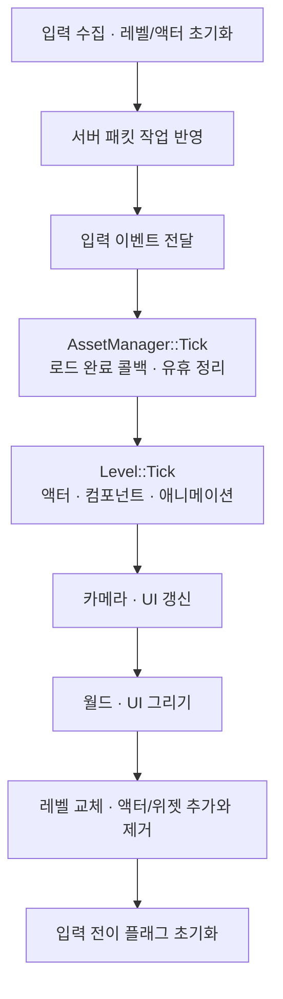
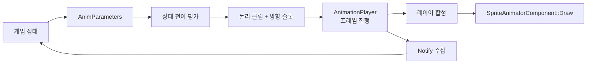
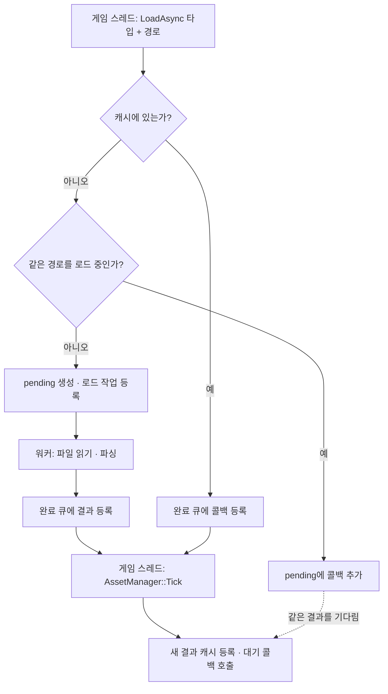
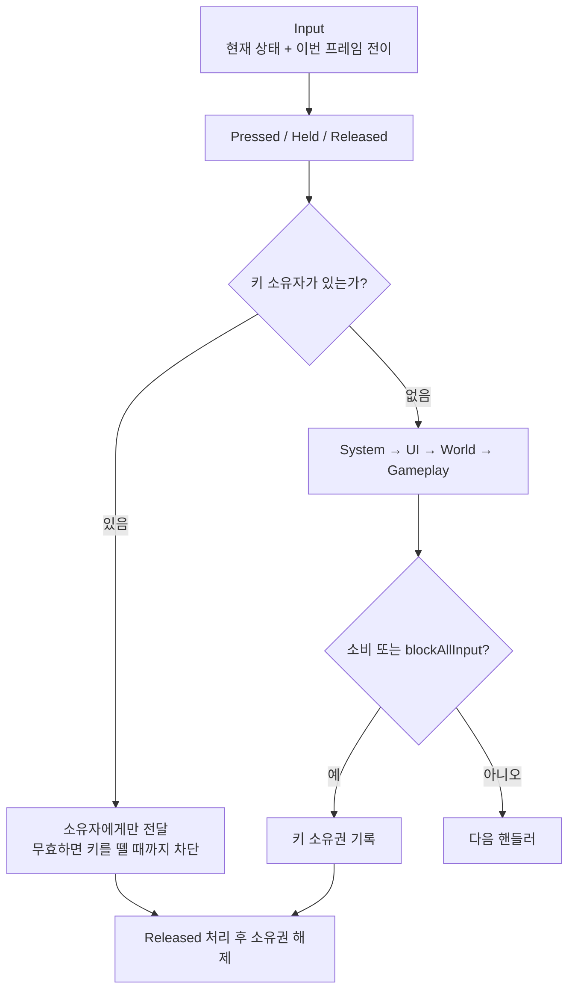
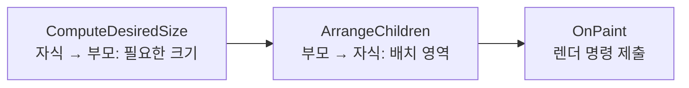

# Terminal Raid — 게임 클라이언트

서버가 결정한 게임 상태를 콘솔 화면에 표현하고, 플레이어의 입력을 전달하는 **C++ 게임 클라이언트**입니다. 자체 엔진인 CraftEngine 위에 플레이어·몬스터·투사체와 메뉴를 구성했습니다.

> 이 문서는 현재 구현을 기준으로 작성한 기술 소개 초안입니다.
>
> 클라이언트에서는 **애니메이션, 에셋 관리, 입력과 UI**를 중심으로 설명합니다. 호출 순서와 핵심 코드를 직접 따라가는 내용은 **[게임 클라이언트 코드 읽기](docs/client-code-walkthrough.md)**에 정리했습니다. 로컬 플레이어 예측·원격 액터 보간·투사체 이동은 서버 문서와 연결되는 별도 주제입니다.

---

## 프로젝트 소개

| 구성 | 역할 |
|---|---|
| `GameProj` | 서버 상태 반영, 게임 액터, 입력 바인딩, 메뉴·사망 화면 |
| `Submodules/CraftEngine` | 게임 루프, 액터·컴포넌트, 애니메이션, 에셋, 입력, UI, 콘솔 렌더링 |
| `Assets` | 액터 수치, 애니메이션 클립, 상태 머신, 맵·배치 데이터 |
| `Common/Protobuf` | 서버와 주고받는 패킷 정의 |
| `Tools` | 애니메이션·맵·프롭 원본을 실행용 데이터로 변환 |

```text
Client/
├─ GameProj/source/
│  ├─ Game.cpp                    # 초기화, 기본 데이터 등록, HUD 구성
│  ├─ Game/ObjectManager.*        # 서버 objectId와 화면 액터 연결
│  ├─ Actor/                      # 캐릭터·투사체와 화면 오버레이
│  ├─ Level/MenuLevel.*           # 시작 메뉴와 접속 시작
│  ├─ Network/                    # 서버 연결, 송신, 이동 보간
│  └─ Protocol/                   # 패킷 처리와 생성 코드
├─ Submodules/CraftEngine/Source/
│  ├─ Animation/                  # 상태 전이, 재생, 방향 선택, 합성
│  ├─ Asset/                      # 데이터 로더와 캐시
│  ├─ Component/                  # SpriteAnimatorComponent 등
│  ├─ Input/                      # 입력 수집, 이벤트 전달, 키 소유권
│  └─ UI/                         # 위젯 수명, 배치, 그리기
├─ Assets/
│  ├─ PrimaryAssets.xml           # 기본 데이터 목록
│  ├─ Animation/                  # 클립과 이름→경로 매핑
│  ├─ StateMachine/               # Canvas 기반 애니메이션 상태 머신
│  └─ Level/                      # 지형·프롭·배치
└─ Tools/
```

게임 코드는 **어떤 상태인지**를 결정하고, 엔진은 **그 상태를 어떻게 실행하고 표현할지**를 담당합니다. 엔진 구현은 `Libraries`의 복사된 헤더가 아닌 `Submodules/CraftEngine/Source`를 기준으로 설명합니다.

## 기술 스택

| 구분 | 내용 |
|---|---|
| 언어·툴셋 | C++20, MSVC v145, x64 |
| 화면 출력 | Windows 콘솔, 스프라이트 문자 맵, 팔레트, 이중 버퍼 |
| 애니메이션 | Canvas/XML 상태 머신, 방향별 클립, 프레임·종료 Notify |
| 에셋 | 타입별 캐시, 비동기 로딩, 완료 큐, 공유 참조 기반 유휴 정리 |
| 입력·UI | Pressed/Held/Released, 우선순위·소비·키 소유권, 위젯 트리 |
| 통신·직렬화 | TCP / CraftEngine의 select 기반 통신, Protobuf |

## 목차

- [클라이언트의 처리 흐름](#클라이언트의-처리-흐름)
- [애니메이션](#애니메이션)
- [에셋 관리](#에셋-관리)
- [입력과 UI](#입력과-ui)
- [아쉬운 점과 개선 방향](#아쉬운-점과-개선-방향)
- [검증과 시연 항목](#검증과-시연-항목)
- [관련 코드와 문서](#관련-코드와-문서)

---

## 클라이언트의 처리 흐름

`Game.cpp`에서 엔진과 기본 데이터를 준비한 뒤 메뉴를 표시합니다. Game Start를 누르면 서버에 연결하고, 방 입장 응답을 받은 `ObjectManager`가 게임 레벨과 액터를 준비합니다.



네트워크 스레드는 패킷 처리 결과를 게임 스레드 작업 큐에 넣습니다. 에셋 워커도 로딩 결과를 완료 큐에 넣고, 캐시 등록과 사용 객체의 갱신은 게임 스레드에서 처리합니다. **외부 작업의 결과를 프레임의 정해진 위치에서 반영하는 구조**입니다. 두 큐는 별개이며 소비 시점도 다릅니다.

---

## 애니메이션

### 게임 상태와 재생 처리를 분리한 이유

> **문제 상황**
>
> 플레이어 코드에서 이동·공격·피격마다 클립을 직접 선택하면 게임 로직에 애니메이션 전이 조건이 함께 늘어납니다. 방향이 바뀔 때마다 재생을 처음부터 시작하면 걷기와 공격의 진행도 끊깁니다.

> **해결 방법**
>
> 캐릭터는 `speed`, `IsAttack`, `IsRolling`, `IsHit`, `IsDead` 등의 파라미터를 전달하고, 상태 머신이 클립을 선택하도록 구성했습니다. 같은 동작에서 방향만 바뀌면 재생 진행률을 유지합니다.



위 그림은 데이터의 관계입니다. 실제 로컬 플레이어는 `super::Tick()`에서 애니메이터를 실행한 **뒤에** 파라미터를 갱신하므로, 새 파라미터는 다음 애니메이션 평가에서 사용합니다. 방향은 `ReplCharacter::UpdateFacing()`에서 애니메이터 실행 전에 전달합니다.

### 데이터로 정의한 상태 전이

`AnimationData.xml`은 캐릭터 이름을 클립과 상태 머신 파일 경로로 연결합니다. 현재 캐릭터 상태 머신은 `.canvas` 파일을 읽습니다. 노드는 상태, 연결선은 조건이며, 로더가 실행용 상태와 전이로 변환합니다.

기사 데이터에는 `Idle`, `Walk`, `Attack`, `Roll`, `Hit`, `Death`가 있습니다. `Any`에서 시작하는 전이는 현재 상태와 관계없이 검사합니다. Canvas의 `[0]`, `[1]`, `[2]`는 전이 우선순위이며 작은 값부터 검사하므로 사망·피격·구르기를 먼저 처리하도록 표현할 수 있습니다.

상태 머신은 정렬된 전이 중 조건이 모두 참인 첫 전이를 선택합니다. 한 번의 평가에서 연쇄 전이는 최대 3회로 제한합니다. 서버의 AI 행동 트리와는 별개의 **화면 표현용 상태 머신**입니다.

### 방향을 바꿔도 재생이 이어지도록 처리

`Walk` 같은 논리 이름에 방향별 클립을 연결합니다. 제작된 좌우 방향 중 한쪽이 없으면 반전으로 보완하고, 앞뒤나 나머지 빈 슬롯은 폴백 규칙으로 채웁니다.

<!-- source-excerpt: Submodules/CraftEngine/Source/Animation/AnimInstance.cpp:314:322 -->
[AnimInstance.cpp:314-322](https://github.com/chibi1541/craft-engine/blob/b96fbc5eef4b648d55be53daef0edcbf63eeca04/Source/Animation/AnimInstance.cpp#L314)

```cpp
if (currentState->clipName == layer.playingLogicalClip
	&& slot->clip != layer.player.GetClip())
{
	layer.player.RetargetClip(slot->clip);
}
else
{
	layer.player.Play(slot->clip);
}
```

`Play()`는 다른 클립을 시작할 때 재생 상태를 초기화합니다. `RetargetClip()`은 기존 정규화 진행률을 새 클립의 프레임 수에 맞춰 옮깁니다. 따라서 프레임 수가 다른 방향 클립 사이에서도 단순히 같은 프레임 번호를 복사하는 문제를 피합니다.

### 레이어 합성과 종료 알림

엔진은 **전신을 담당하는 Base와 선택적인 Overlay**를 제공합니다. Overlay는 지정된 행만 덮어쓰고, 폭이 다른 그림은 피벗을 기준으로 맞춥니다.

| 설정 위치 | `canBlend`의 의미 |
|---|---|
| Base 상태 | `false`이면 Overlay의 화면 합성과 Notify 수집을 막습니다. |
| Overlay 상태 | `true`이면 투명 셀을 건너뛰고, `false`이면 투명 셀까지 덮어써 담당 영역을 교체합니다. |

현재 기사·궁수·마법사·몬스터의 등록된 상태 머신은 **Base만 사용**합니다. 두 레이어 합성은 엔진에 구현되어 있고 `player_anim_state_test.canvas` 등의 데이터에서 확인할 수 있습니다. 현재 전투 캐릭터 모두가 상·하체 합성을 사용한다고 설명하지는 않습니다.

클립의 `RollEnd`, `HitEnd`, `DeathEnd`는 게임 코드로 전달하는 종료 알림입니다. 한 틱에 여러 프레임을 지나도 진입한 프레임 목록을 기록해 중간 Notify를 수집합니다. 피격·사망 연출에는 종료 알림을 놓쳤을 때를 위한 타이머도 있습니다. 이 알림으로 서버의 피해·명중을 판정하는 것은 아닙니다.

---

## 에셋 관리

### 기본 데이터와 실제 리소스의 분리

> **문제 상황**
>
> 같은 몬스터가 여러 마리 등장할 때마다 같은 XML을 읽으면 중복 작업이 발생합니다. 파일 읽기와 파싱을 게임 루프에서 수행하면 해당 작업이 끝날 때까지 프레임 진행도 기다립니다.

> **해결 방법**
>
> 이름·경로·수치 등의 기본 데이터는 시작 시 준비하고, 클립·맵·프롭은 타입별 캐시와 비동기 로딩 경로로 관리합니다. 같은 타입과 경로에 대한 진행 중 요청은 하나의 로드 결과를 공유합니다.

| 구분 | 로드 시점·방법 | 수명 |
|---|---|---|
| Primary 데이터 | `PrimaryAssets.xml`을 따라 시작 시 동기 로드 | 매니저가 유지, 유휴 정리 제외 |
| 클립·맵·배치·프롭 | 등록된 타입별 로더로 동기 또는 비동기 로드 | 캐시와 사용 객체가 공유 |
| 애니메이션 상태 머신 | 캐릭터 클립 로드 완료 후 동기 파싱 | 해당 `AnimInstance`에 구성 |

상태 머신까지 모두 워커에서 읽는 구조는 아닙니다. 캐릭터의 클립 이름을 검증해야 하므로 **클립 등록 → 방향 슬롯 구성 → 상태 머신 로드** 순서로 초기화합니다.

### 같은 요청을 합치고 게임 스레드에서 결과 반영



<!-- source-excerpt: Submodules/CraftEngine/Source/Asset/AssetManager.h:170:178 -->
[AssetManager.h:170-178](https://github.com/chibi1541/craft-engine/blob/b96fbc5eef4b648d55be53daef0edcbf63eeca04/Source/Asset/AssetManager.h#L170)

```cpp
// 2) 이미 같은 경로를 로드 중이면 콜백만 덧붙인다(중복 파싱 방지).
auto pendingIt = cache.pending.find(key);

if (pendingIt != cache.pending.end())
{
	pendingIt->second.push_back(onLoaded);

	return;
}
```

`pending`에는 파일 자체 대신 완료를 기다리는 콜백들이 들어갑니다. 같은 종류의 캐릭터가 연속으로 생성되어도 해당 경로를 읽는 작업은 합치고, 완료 시 각 캐릭터에게 결과를 전달합니다.

캐시 적중 시에도 콜백을 즉시 호출하지 않고 완료 큐에 넣습니다. 호출자는 캐시 유무에 따라 초기화 타이밍을 다르게 처리할 필요가 없습니다. 단, 여기서 말하는 타이밍은 **다음 완료 큐 소비 시점**이며 반드시 다음 프레임이라는 뜻은 아닙니다.

### 공유 리소스와 유휴 정리

캐시는 `shared_ptr<const T>`로 데이터를 보관합니다. 애니메이션 클립은 여러 액터가 공유하고, 현재 프레임·경과 시간·상태 머신은 액터별 인스턴스에서 관리합니다.

일반 캐시에서 매니저 외의 참조가 없어지면 유휴 시간을 누적하고, 기본 30초가 지나면 캐시 항목을 제거합니다. `SpriteAnimatorComponent`가 `loadedClips`를 멤버로 보관하는 이유도 사용 중인 클립 묶음의 참조를 유지하기 위해서입니다. 30초는 코드의 설정값이며 메모리 절감량을 측정한 결과는 아닙니다.

---

## 입력과 UI

### 입력 수집과 전달을 분리한 이유

> **문제 상황**
>
> 게임과 메뉴가 같은 키를 각자 확인하면 메뉴를 닫는 입력이 게임에도 전달될 수 있습니다. 이전 프레임과 현재 눌림 상태만 비교하면 한 프레임 안에서 눌렀다 뗀 짧은 입력도 놓칠 수 있습니다.

> **해결 방법**
>
> `Input`은 눌림 상태와 전이 플래그를 기록하고, `InputSystem`은 우선순위에 따라 이벤트를 전달합니다. 입력을 소비한 핸들러는 키를 뗄 때까지 해당 키를 소유합니다.



`InputSystem`은 액터나 위젯 대신 공통 `InputHandler`를 다룹니다. 액터는 `InputComponent`, 입력이 필요한 위젯은 `UserWidget`이 핸들러를 보유합니다. 같은 입력 규칙을 서로 다른 객체에 연결할 수 있습니다.

| 이벤트 | 현재 게임의 사용 예 |
|---|---|
| `Pressed` | Space 구르기, Q/E 시점 회전, Esc 메뉴 토글 |
| `Held` | WASD 이동, 마우스 좌클릭 공격 유지 |
| `Released` | 키 소유권을 해제하는 기준 |

### 메뉴 입력의 소비와 소유권

<!-- source-excerpt: GameProj/source/Actor/PauseMenuActor.cpp:99:109 -->
[PauseMenuActor.cpp:99-109](GameProj/source/Actor/PauseMenuActor.cpp#L99)

```cpp
void PauseMenuActor::SetOpen(bool open)
{
	_open = open;
	_hovered = Button::None;

	if (_input != nullptr)
	{
		// 열려 있는 동안 플레이어(및 다른 하위 우선순위) 입력을 전부 막는다.
		_input->SetBlockAllInput(open);
	}
}
```

일시정지 메뉴는 `System` 우선순위를 사용하고, 열렸을 때 `blockAllInput`을 켭니다. 소유자가 없는 키의 전달 경로에서는 바인딩이 없는 입력도 소비하여 아래 계층으로 내려가지 않게 합니다. 이미 게임플레이가 소유한 키는 우선순위 순회 전에 기존 소유자로 전달되므로, 메뉴를 열기 전부터 누르고 있던 입력은 별도로 확인해야 합니다.

메뉴를 닫는 입력의 소유자가 사라져도 그 키를 바로 게임플레이로 넘기지 않습니다. 키를 놓을 때까지 차단한 뒤 소유권을 해제하여, 누름을 받지 않은 객체가 유지·해제 이벤트만 받는 상황을 줄입니다. 메뉴는 입력을 제어하며 서버 월드 진행을 멈추지는 않습니다.

### 위젯 배치와 현재 게임의 적용 범위

엔진의 `UISystem`은 위젯 트리를 다음 순서로 그립니다.



뷰포트 추가·제거는 요청 목록에 저장하고 프레임 끝에서 반영합니다. `UserWidget`은 화면에 올라갈 때 입력을 등록하고, 내려갈 때 해제합니다. 레벨 교체 시 `persistent`가 아닌 위젯은 정리합니다.

현재 게임의 UI 구현은 다음 두 경로가 함께 사용됩니다.

| 화면 | 현재 구현 |
|---|---|
| 안내·네트워크 HUD | `Border`와 `TextBlock`을 조합해 `UISystem`에 등록 |
| 시작 메뉴 | `MenuLevel`이 마우스 영역을 검사하고 직접 렌더 명령 제출 |
| 일시정지 메뉴 | `PauseMenuActor`가 Esc를 바인딩하고, 버튼은 마우스 상태를 직접 조회 |
| 사망·부활 화면 | `DeathScreenActor`가 사망 연출 완료 후 표시하고 부활 패킷 전송 |

따라서 모든 게임 화면이 `UserWidget` 기반이거나 모든 클릭이 입력 소비 규칙을 거친다고 설명하면 실제 구현과 다릅니다. `Input::GetKeyDown()` 직접 조회에는 `InputSystem`의 소비 결과가 반영되지 않습니다.

---

## 아쉬운 점과 개선 방향

현재 소스에서 확인되는 경계 조건입니다. 수정 완료나 실행 검증 결과를 뜻하지 않습니다.

- **비동기 콜백의 수명 확인:** 캐릭터의 완료 콜백은 약한 참조를 확인하지만, 그보다 앞에서 `SpriteAnimatorComponent` 내부 콜백이 캡처한 `this`에 접근합니다. 로드 중 디스폰되는 경우를 고려해 컴포넌트 접근 전부터 수명을 확인해야 합니다.
- **입력 차단의 적용 범위:** 기존 키 소유권과 메뉴의 전체 차단이 만나는 경우, 직접 폴링하는 UI끼리 겹치는 경우까지 정책을 정리할 필요가 있습니다.
- **HUD의 레벨 수명:** Game Start에서 만든 HUD는 비영속 위젯입니다. 현재 레벨 교체의 정리 대상이므로, 인게임 HUD로 계속 유지하려면 생성 시점이나 수명 정책을 정리해야 합니다. 표시된 `M : menu` 안내도 실제 Esc 바인딩과 다릅니다.
- **표현 경로의 일관성:** 현재 Base만 쓰는 캐릭터에 합성 기능을 적용하려면 실제 아트와 Overlay 데이터를 연결해야 합니다. 파라미터 갱신 순서와 매 프레임 수행하는 UI 배치도 개선 후보입니다.

자세한 근거와 확인 순서는 코드 해설의 [현재 구현에서 구분해서 볼 점](docs/client-code-walkthrough.md#5-현재-구현에서-구분해서-볼-점)에 정리했습니다.

## 검증과 시연 항목

문서 작성 과정에서는 호출 경로, 데이터의 실제 사용 여부, 발췌 코드와 링크를 확인했습니다. 아래는 **추가로 실행하며 확인할 항목**이며 완료된 성능 측정이나 테스트 결과가 아닙니다.

| 시연 | 관찰할 내용 |
|---|---|
| 걷는 도중 조준 방향 변경 | 상태는 유지하면서 방향 클립의 재생 진행률이 이어지는지 |
| 피격·사망·구르기 | 상태 전이, 종료 Notify, 게임 플래그 해제 시점 |
| 동일 몬스터 여러 마리 생성 | 같은 클립 요청의 `pending` 병합과 캐시 공유 |
| 로딩 도중 액터 제거 | 완료 콜백에서 파괴된 객체를 접근하는지 |
| 메뉴를 연 뒤 새 키 입력 / 키를 누른 채 메뉴 열기 | 새 입력 차단과 기존 키 소유권의 차이 |
| 사망 화면과 메뉴 겹침 | 직접 마우스 조회 경로 사이의 중복 반응 여부 |
| 메뉴에서 게임으로 입장 | HUD가 레벨 교체 시 제거되는 경로 |

## 관련 코드와 문서

- [게임 클라이언트 코드 읽기](docs/client-code-walkthrough.md)
- [애니메이션 실행기](https://github.com/chibi1541/craft-engine/blob/b96fbc5eef4b648d55be53daef0edcbf63eeca04/Source/Animation/AnimInstance.cpp)
- [에셋 매니저](https://github.com/chibi1541/craft-engine/blob/b96fbc5eef4b648d55be53daef0edcbf63eeca04/Source/Asset/AssetManager.h)
- [입력 전달](https://github.com/chibi1541/craft-engine/blob/b96fbc5eef4b648d55be53daef0edcbf63eeca04/Source/Input/InputSystem.cpp)
- [위젯 관리와 배치](https://github.com/chibi1541/craft-engine/blob/b96fbc5eef4b648d55be53daef0edcbf63eeca04/Source/UI/UISystem.cpp)
- [현재 캐릭터의 상태 머신 경로](Assets/Animation/AnimationData.xml)

문서 구성과 설명 방식은 기존 [console-game](https://github.com/chibi1541/console-game), [cpp-server](https://github.com/chibi1541/cpp-server)의 README를 참고했습니다. 설명과 코드는 이 프로젝트의 현재 구현을 기준으로 작성했습니다.
